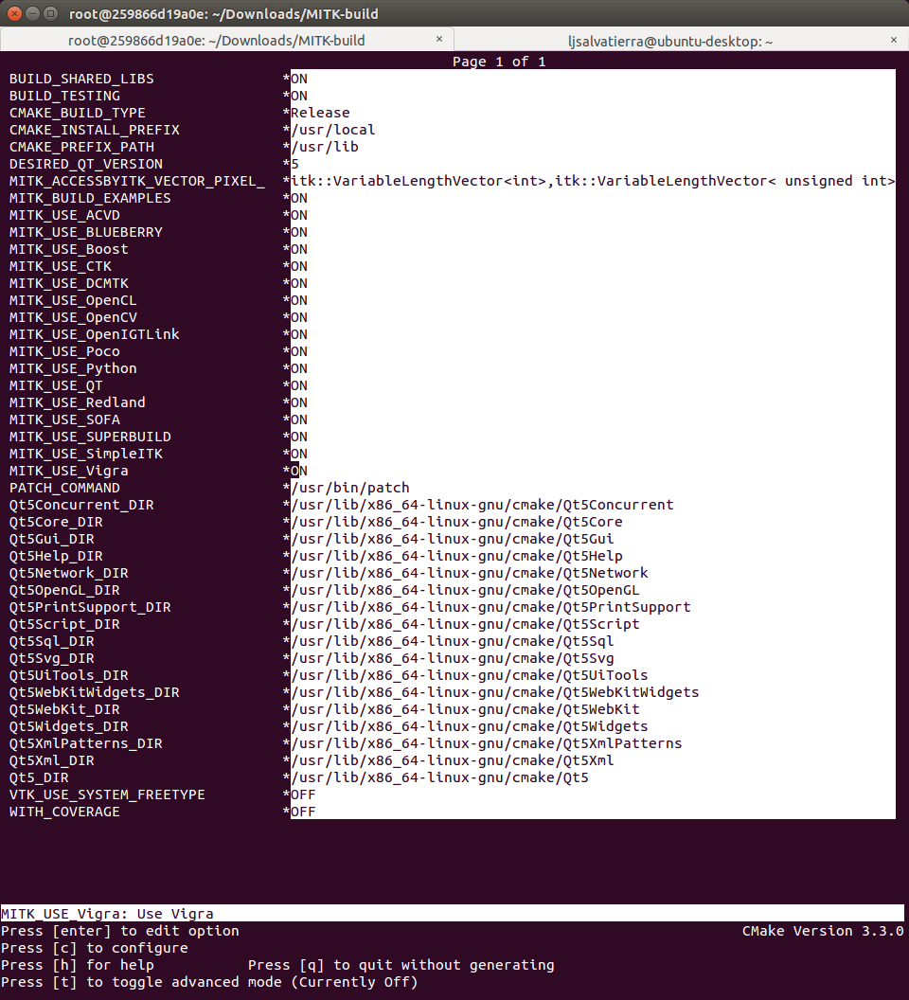
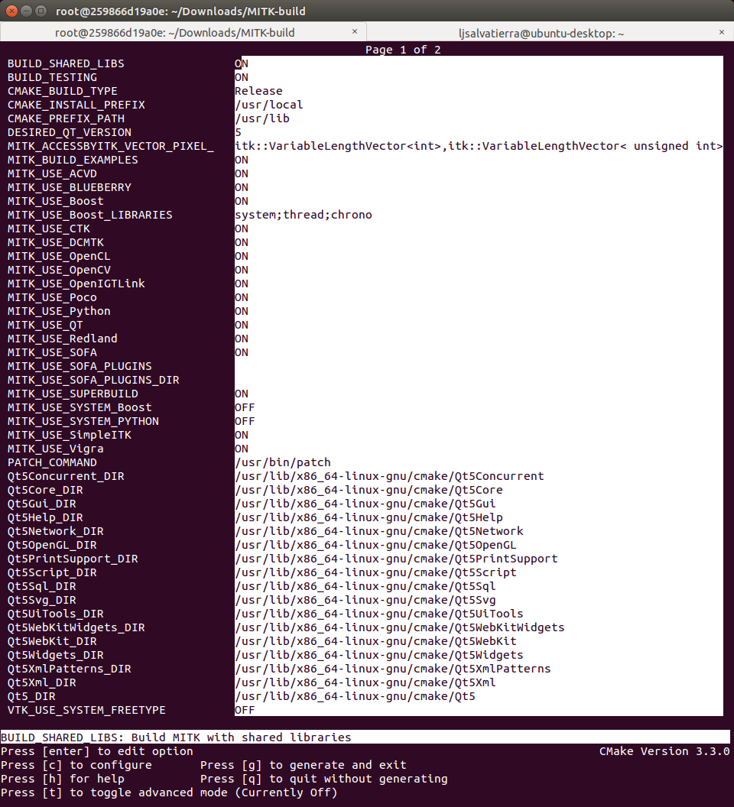
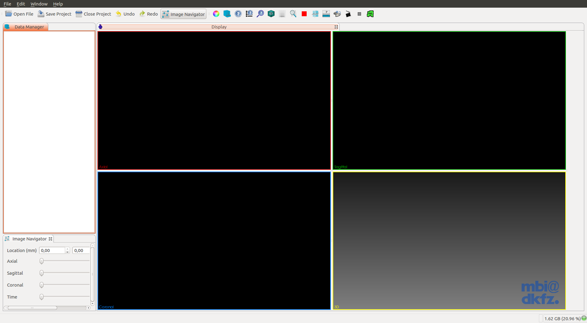

Title: How to compile MITK on Docker
Date: 2015-08-13
Category: MITK
Tags: MITK, Docker

##Prerequisites

- Docker
 - GIT
 - CMake (version 3.2 or higher. Current stable 3.3)
 - Qt 5.x
  - Make sure that you select a Qt version which provides the right **OpenGL-enabled** packages for your architecture and compiler

Install dependencies.:

1. Install Docker.:

```bash
$ sudo apt-get update
$ sudo apt-get install curl
$ curl -sSL https://get.docker.com/ | sh
```

* **Docker - Ubuntu:14.04.:**

```bash
$ docker pull ubuntu:14.04
$ docker images
$ docker run -i -t <IMAGE_ID> /bin/bash
```

* Inside Docker.:

```bash
root@XXXXX:$ apt-get update && apt-get install -y \
    software-properties-common \
    && apt-add-repository multiverse \
    && apt-get update \
    && apt-get install -y \
    bison build-essential curl git libarchive-dev libbz2-ocaml-dev libcurl4-openssl-dev \
    libexpat-ocaml-dev libfaac-dev libmp3lame-dev libopencore-amrnb-dev libopencore-amrwb-dev \
    libqt5svg5-dev libqt5webkit5-dev libqt5xmlpatterns5-dev libtheora-dev libtiff5-dev \
    libvorbis-dev libvpx-dev libwrap0-dev libxi-dev libxmu-dev pkg-config qt5-default \
    qtscript5-dev qttools5-dev qttools5-dev-tools vim wget yasm
```

* **Docker - Ubuntu:15.04.:**

```bash
$ docker pull ubuntu:15.04
$ docker images
$ docker run -i -t <IMAGE_ID> /bin/bash
```

* Inside Docker.:

```bash
root@XXXXX:$ apt-get update && apt-get install -y \
    software-properties-common \
    && apt-add-repository multiverse \
    && apt-get update \
    && apt-get install -y \
    bison build-essential curl git libarchive-dev libbz2-ocaml-dev libcurl4-openssl-dev \
    libexpat1-dev libfaac-dev libmp3lame-dev libopencore-amrnb-dev libopencore-amrwb-dev \
    libqt5svg5-dev libqt5webkit5-dev libqt5xmlpatterns5-dev libtheora-dev libtiff5-dev \
    libvorbis-dev libvpx-dev libwrap0-dev libxi-dev libxmu-dev python3-dev pkg-config \
    qt5-default qtscript5-dev qttools5-dev qttools5-dev-tools vim wget yasm
```

* **Docker - Ubuntu:14.04 and Ubuntu:15.04.:**

```bash
# OpenCL for Intel/AMD:
        root@XXXXX:$ apt-get install ocl-icd-opencl-dev

# OpenCL for Nvidia:
        root@XXXXX:$ apt-get install nvidia-opencl-icd-XXX
        	   # Where XXX is the version. Current 346
```

Docker - Build Cmake 3.3.0.:

```bash
root@XXXXX:$ wget -c http://www.cmake.org/files/v3.3/cmake-3.3.0.tar.gz
root@XXXXX:$ tar xvzf cmake-3.3.0.tar.gz && cd cmake-3.3.0
root@XXXXX:$ ./bootstrap --prefix=/usr --system-libs --mandir=/share/man --no-system-jsoncpp \
  --docdir=/share/doc/cmake-3.3.0 --qt-gui
root@XXXXX:$ make && make install
```

Docker - Build FFmpeg, we need it for OpenCV.:

```bash
root@XXXXX:$ git clone https://github.com/FFmpeg/FFmpeg.git
root@XXXXX:$ cd FFmpeg
root@XXXXX:$ ./configure --enable-gpl --enable-libfaac --enable-libmp3lame --enable-libopencore-amrnb \
    --enable-libopencore-amrwb --enable-libtheora --enable-libvorbis --enable-libvpx \
    --enable-nonfree --enable-version3 --enable-x11grab --enable-shared --enable-pic
root@XXXXX:$ make && make install
```

Docker - Build MITK.:

```bash
root@XXXXX:$ git clone http://git.mitk.org/MITK.git
root@XXXXX:$ mkdir MITK-build && cd MITK-build
root@XXXXX:$ ccmake ../MITK
```





* **Note: in Ubuntu:14.04 you CAN'T select the option 'MITK_USE_Python', because It needs Qt >= 5.3**

```bash
# Press 'c' to configure and 'g' to generate and exit.

root@XXXXX:$ make
# I do NOT recommend running `make` with the option `-j4`. You'll get dependency related errors during the build.
# This last command will take several hours, so go and take a walk (in another city) :)

root@XXXXX:$ exit
$ docker ps -l
CONTAINER ID        IMAGE                  COMMAND             CREATED             STATUS                     PORTS               NAMES
b378149da6c6        ubuntu:15.04           "/bin/bash"         8 hours ago         Exited (0) 10 seconds ago                      focused_newton

$ docker commit <CONTAINER_NAME> ubuntu15/mitk:latest
# See the CONTAINER_NAME on the right of `docker ps -l`
```

Docker - Running MITK.:

1. Create a <a href="https://docs.docker.com/reference/builder/" target="_blank">Dockerfile</a>.:

```bash
FROM <IMAGE>
MAINTAINER <YOUR_NAME>

ENV MITK_WORKBENCH /path/to/MITK-build/bin/MitkWorkbench
CMD $MITK_WORKBENCH
```
* Where `<IMAGE>` is the name of the image where we have installed MITK.
 - e.g.: FROM ubuntu15/mitk:latest
```bash
$ docker images
REPOSITORY          TAG                 IMAGE ID            CREATED             VIRTUAL SIZE
ubuntu15/mitk       latest              19af721ab6a3        11 hours ago        13.2 GB
```

2. Build a new image with the Dockerfile.:

```bash
$ docker build --rm -t mitk:15.04 .
$ docker images
REPOSITORY          TAG                 IMAGE ID            CREATED             VIRTUAL SIZE
mitk                15.04               bdcce6cafa44        26 minutes ago      13.2 GB
$ docker ps -l
CONTAINER ID        IMAGE               COMMAND             CREATED             STATUS                      PORTS               NAMES
2f140ab82356        mitk:15.04          "/bin/bash"         42 minutes ago      Exited (0) 41 minutes ago                       silly_galileo
$ xhost +local:`docker inspect --format='{{ .Config.Hostname }}' <CONTAINER_ID>`
$ docker run -ti --rm -e DISPLAY=$DISPLAY -v /tmp/.X11-unix:/tmp/.X11-unix mitk:15.04
```



