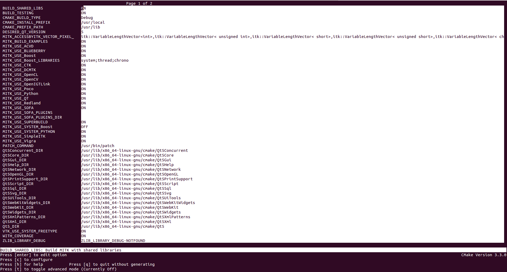

Title: How to compile MITK on Ubuntu
Date: 2015-08-10
Category: MITK

##Prerequisites

- GIT
- CMake (version 3.2 or higher. Current stable 3.3)
- Qt 5.x
 - Make sure that you select a Qt version which provides the right **OpenGL-enabled** packages for your architecture and compiler

##Building

Install some dependencies.:

```bash
$ sudo apt-get install qt5-default qtscript5-dev libqt5svg5-dev libqt5webkit5-dev \
  libqt5xmlpatterns5-dev qttools5-dev qttools5-dev-tools libtiff5-dev libwrap0-dev \
  libxmu-dev libxi-dev bison

# OpenCL for Intel/AMD:
	$ sudo apt-get install ocl-icd-opencl-dev

# OpenCL for Nvidia:
	$ sudo apt-get install nvidia-opencl-icd-XXX
	# Where XXX is the version. Current 346

```

Build cmake 3.3.:

```bash
$ wget -c http://www.cmake.org/files/v3.3/cmake-3.3.0.tar.gz
$ tar xvzf cmake-3.3.0.tar.gz && cd cmake-3.3.0
$ ./bootstrap --prefix=/usr --system-libs --mandir=/share/man --no-system-jsoncpp --docdir=/share/doc/cmake-3.3.0 --qt-gui
$ make
$ sudo make install
```

Build ffmpeg, we need it for OpenCV.:

```bash
$ sudo apt-get install yasm libfaac-dev libmp3lame-dev libopencore-amrnb-dev \
  libopencore-amrwb-dev libvpx-dev 
$ git clone git@github.com:FFmpeg/FFmpeg.git
$ cd FFmpeg
$ ./configure --enable-gpl --enable-libfaac --enable-libmp3lame --enable-libopencore-amrnb \ 
    --enable-libopencore-amrwb --enable-libtheora --enable-libvorbis --enable-libvpx \
    --enable-nonfree --enable-version3 --enable-x11grab --enable-shared --enable-pic
$ make
$ sudo make install
```

Build MITK.:

```bash
$ git clone http://git.mitk.org/MITK.git
$ mkdir MITK-build && cd MITK-build
$ ccmake ../MITK
# Press 'c' to configure and 'e' to continue.
# Select desired options.
```




```bash
# Press again 'c' to configure and 'e' to continue.
# Press 'g' to generate and exit.

$ make
# I do not recommend running `make` with the option `-j4`. At least the first time, because of Its dependencies.
```

If you encounter any problems building MITK, try building your self some of Its dependencies.:

Build Boost if needed.:

- Download Boost from the official webpage <a href="http://www.boost.org/" target="_blank">Boost C++ Libraries</a>.

```bash
$ tar --bzip2 -xf /path/to/boost_1_XX_X.tar.bz2 && cd boost_1_XX_X #Current `boost_1_58_0`
$ ./bootstrap.sh --prefix=/usr/local --with-python=/usr/bin/python2 #It doesn't work with Python3
$ mkdir ../boost-build
$ sudo ./b2 -q --build-dir=../boost-build variant=release install
```

Build OpenCV if needed.:

```bash
$ sudo apt-get install build-essential
$ sudo apt-get install libgtk2.0-dev pkg-config libavcodec-dev libavformat-dev libswscale-dev
$ sudo apt-get install python-dev python-numpy libtbb2 libtbb-dev libjpeg-dev libpng-dev libtiff-dev libjasper-dev libdc1394-22-dev
$ git clone git@github.com:Itseez/opencv.git
$ mkdir opencv-build && cd opencv-build
$ ccmake ../opencv
# Press 'c' to configure and 'e' to continue.
# Select desired options. I've selected everything except CUDA related options, because I don't have a CUDA GPU card.
# Press 'c' again and 'e' to continue.
# Press 'g' to generate and exit.

$ make -j4

# Where *4 is the number of CPU Threads.
# The last command will take several minutes to complete.

$ sudo make install
```

Build VTK if needed.:

```bash
$ sudo apt-get install tk-dev
$ git clone git://vtk.org/VTK.git
$ mkdir VTK-build && cd VTK-build
$ ccmake ../VTK
# Press 'c' to configure and 'e' to continue.
# Select desired options.
# VTK_WRAP_PYTHON ON
# VTK_QT_VERSION 5
# ...
# Press again 'c' to configure and 'e' to continue.
# Press 'g' to generate and exit.

$ make -j4
$ sudo make install
```

Build SOFA if needed.:

```bash
$ git clone git://scm.gforge.inria.fr/sofa/sofa.git
$ sudo apt-get install build-essential libqt4-dev libqt4-opengl-dev libglew-dev freeglut3-dev libpng-dev
$ sudo apt-get install ccache
$ sudo apt-get install zlib1g-dev python2.7-dev libxml2-dev libcgal-dev libblas-dev liblapack-dev libsuitesparse-dev libboost-all-dev libassimp-dev liboce-foundation-dev
$ mkdir sofa-build && cd sofa-build
$ CC="gcc" CXX="g++" cmake -DCMAKE_BUILD_TYPE=Release  ../sofa
$ cmake .
$ make -j4
```

Build GDCM if needed.:

```bash
$ sudo apt-get install swig
$ git clone --branch release git://git.code.sf.net/p/gdcm/gdcm
$ mdkir gdcm-build && cd gdcm-build
$ ccmake ../gdcm
# Press 'c' to configure and 'e' to continue.
# Select desired options. I have selected everything except BUILD_WITH_VTK, CSHARP, JAVA and PHP.
# Press again 'c' to configure and 'e' to continue.
# Press 'g' to generate and exit.

$ make
$ sudo make install
```

##<a name="testing"></a>Testing

```bash
$ cd ~/Downloads && wget -c http://mitk.org/download/tutorial-data/Pic3D.nrrd
$ cd /path/to/MITK-build/MITK-build #Yes, It's repeated.
$ ./bin/MitkWorkbench
```


* Open the downloaded imagen in `~/Downloads`


