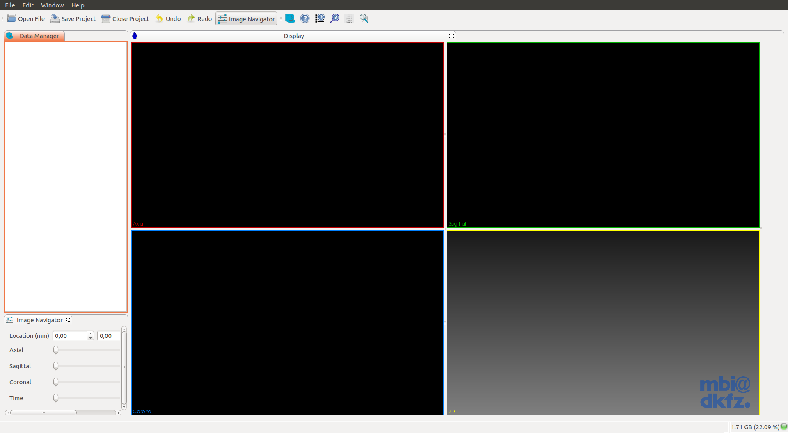
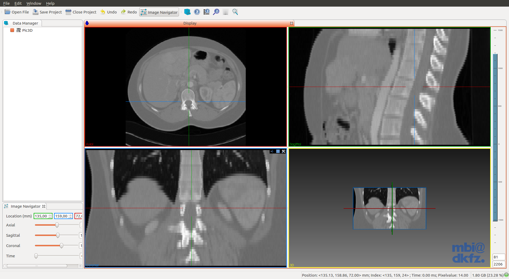

Title: How to compile MITK on Ubuntu
Date: 2015-08-10
Category: MITK

##Prerequisites

- GIT
- CMake (version 3.2 or higher. Current stable 3.3)
- Qt 5.x
 - Make sure that you select a Qt version which provides the right **OpenGL-enabled** packages for your architecture and compiler

##Building

Install some dependencies.:

```bash
$ sudo apt-get install qt5-default qtscript5-dev libqt5svg5-dev libqt5webkit5-dev libqt5xmlpatterns5-dev qttools5-dev qttools5-dev-tools libtiff5-dev libwrap0-dev
```

Build cmake 3.3.:

```bash
$ wget -c http://www.cmake.org/files/v3.3/cmake-3.3.0.tar.gz
$ tar xvzf cmake-3.3.0.tar.gz && cd cmake-3.3.0
$ ./bootstrap --prefix=/usr --system-libs --mandir=/share/man --no-system-jsoncpp --docdir=/share/doc/cmake-3.3.0 --qt-gui
$ make
$ sudo make install
```

Build OpenCV if needed.:

```bash
$ sudo apt-get install build-essential
$ sudo apt-get install libgtk2.0-dev pkg-config libavcodec-dev libavformat-dev libswscale-dev
$ sudo apt-get install python-dev python-numpy libtbb2 libtbb-dev libjpeg-dev libpng-dev libtiff-dev libjasper-dev libdc1394-22-dev
$ git clone git@github.com:Itseez/opencv.git
$ mkdir opencv-build && cd opencv-build
$ ccmake ../opencv
Press 'c' to configure and 'e' to continue.
Select desired options. I've selected everything except CUDA related options, because I don't have a CUDA GPU card.
Press 'c' again and 'e' to continue.
Press 'g' to generate and exit.

$ make -j4

Where *4 is the number of CPU Threads.
The last command will take several minutes to complete.

$ sudo make install
```

Build VTK if needed.:

```bash
$ sudo apt-get install tk-dev
$ git clone git://vtk.org/VTK.git
$ mkdir VTK-build && cd VTK-build
$ ccmake ../VTK
Press 'c' to configure and 'e' to continue.
Select desired options.
#VTK_WRAP_PYTHON ON
#VTK_QT_VERSION 5
...
Press again 'c' to configure and 'e' to continue.
Press 'g' to generate and exit.

$ make -j4
$ sudo make install
```

TODO
====

- SOFA

Build MITK.:

```bash
$ git clone http://git.mitk.org/MITK.git
$ mkdir MITK-build && cd MITK-build
$ ccmake ../MITK
Press 'c' to configure and 'e' to continue.
Select desired options.
Press again 'c' to configure and 'e' to continue.
Press 'g' to generate and exit.

$ make -j4
```

##Testing

```bash
$ cd ~/Downloads && wget -c http://mitk.org/download/tutorial-data/Pic3D.nrrd
$ cd /path/to/MITK-build/MITK-build #Yes, It's repeated.
$ ./bin/MitkWorkbench
```



* Open the downloaded imagen in `~/Downloads`


