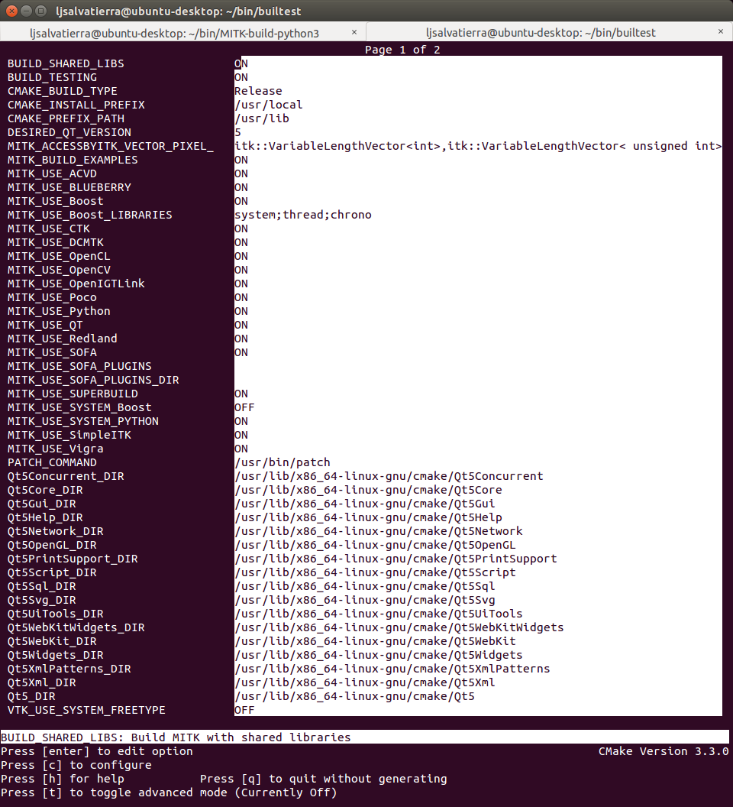
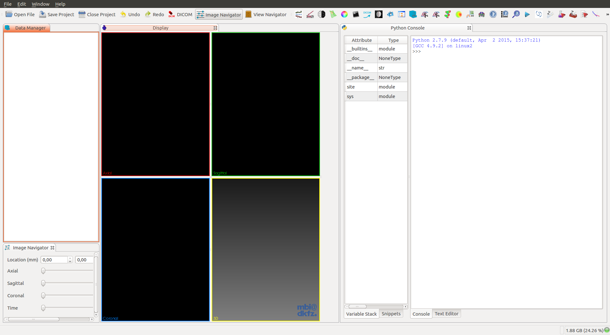
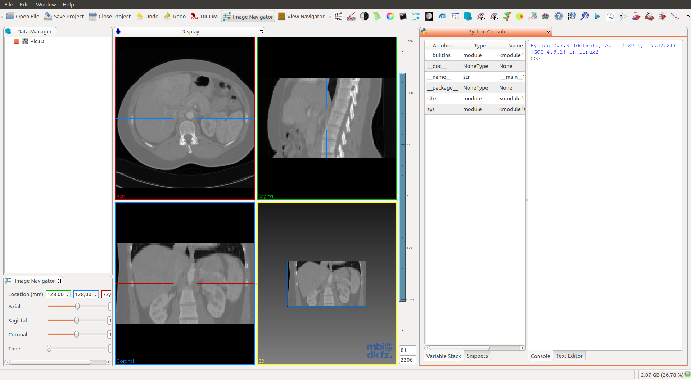

Title: How to compile MITK on Ubuntu
Date: 2015-08-13
Modified: 2015-09-02
Category: MITK, build
Tags: MITK, build, Ubuntu
Author: Luis Javier Salvatierra
Email: ljsalvat@gmail.com
Summary: A short manual on how to compile MITK on Ubuntu with all options enabled.


## Prerequisites

- GIT
- CMake (version 3.2 or higher. Current stable 3.3)
- Qt 5.x
    - Make sure that you select a Qt version which provides the right **OpenGL-enabled** packages for your architecture and compiler

### Install dependencies.:

#### From the Ubuntu packages:

##### Option 1: Ubuntu 14.04:

```bash
$ sudo apt-get update && sudo apt-get install -y \
    software-properties-common \
    && sudo apt-add-repository multiverse \
    && sudo apt-get update \
    && sudo apt-get install -y \
    bison build-essential curl git libarchive-dev libbz2-ocaml-dev libcurl4-openssl-dev \
    libexpat-ocaml-dev libfaac-dev libmp3lame-dev libopencore-amrnb-dev libopencore-amrwb-dev \
    libqt5svg5-dev libqt5webkit5-dev libqt5xmlpatterns5-dev libtheora-dev libtiff5-dev \
    libvorbis-dev libvpx-dev libwrap0-dev libxi-dev libxmu-dev pkg-config qt5-default \
    qtscript5-dev qttools5-dev qttools5-dev-tools vim wget yasm libgtk2.0-dev
```

##### Option 2: Ubuntu 15.04:

```bash
$ sudo apt-get update && sudo apt-get install -y \
    software-properties-common \
    && sudo apt-add-repository multiverse \
    && sudo apt-get update \
    && sudo apt-get install -y \
    bison build-essential curl git libarchive-dev libbz2-ocaml-dev libcurl4-openssl-dev \
    libexpat1-dev libfaac-dev libmp3lame-dev libopencore-amrnb-dev libopencore-amrwb-dev \
    libqt5svg5-dev libqt5webkit5-dev libqt5xmlpatterns5-dev libtheora-dev libtiff5-dev \
    libvorbis-dev libvpx-dev libwrap0-dev libxi-dev libxmu-dev python-dev pkg-config \
    qt5-default qtscript5-dev qttools5-dev qttools5-dev-tools vim wget yasm libgtk2.0-dev
```

#### Install OpenCL:

```bash
# OpenCL for Intel/AMD:
	$ sudo apt-get install ocl-icd-opencl-dev

# OpenCL for Nvidia:
	$ sudo apt-get install nvidia-opencl-icd-XXX
	# Where XXX is the version. Current 346
```

#### Build Cmake 3.3.0:

```bash
$ wget -c http://www.cmake.org/files/v3.3/cmake-3.3.0.tar.gz
$ tar xvzf cmake-3.3.0.tar.gz && cd cmake-3.3.0
$ ./bootstrap --prefix=/usr --system-libs --mandir=/share/man --no-system-jsoncpp \
  --docdir=/share/doc/cmake-3.3.0 --qt-gui
$ make && sudo make install
```

#### Build FFmpeg, we need it for OpenCV:

```bash
$ git clone https://github.com/FFmpeg/FFmpeg.git
$ cd FFmpeg
$ ./configure --enable-gpl --enable-libfaac --enable-libmp3lame --enable-libopencore-amrnb \
    --enable-libopencore-amrwb --enable-libtheora --enable-libvorbis --enable-libvpx \
    --enable-nonfree --enable-version3 --enable-x11grab --enable-shared --enable-pic
$ make && sudo make install
```

#### Build MITK:

```bash
$ git clone http://git.mitk.org/MITK.git
$ mkdir MITK-build && cd MITK-build
$ ccmake ../MITK
```




* **Note:** in Ubuntu:14.04 you CAN'T select the option 'MITK_USE_Python', because It needs Qt >= 5.3
* **Tips:**
    - For a complete installation, press 't' to toggle the advance view. You may select all the options you desire, like compile with all applications and plugins.
    - Also, if you selected `MITK_USE_SYSTEM_PYTHON`, you may want to change `PYTHON_EXECUTABLE`,`PYTHON_INCLUDE_DIR` and `PYTHON_LIBRARY` to your respective installation. For now, It's not possible to use Python 3, so you'll have to use Python2.7.

```bash
# Press 'c' to configure and 'g' to generate and exit.

$ make
# I do NOT recommend running `make` with the option `-j4`. You'll get dependency related errors during the build.
# This last command will take several hours, so go and take a walk (in another city) :)
```

If you encounter any problems building MITK, try building your self some of Its dependencies.:

#### Build Boost if needed:

- Download Boost from the official webpage <a href="http://www.boost.org/" target="_blank">Boost C++ Libraries</a>.

```bash
$ tar --bzip2 -xf /path/to/boost_1_XX_X.tar.bz2 && cd boost_1_XX_X #Current `boost_1_58_0`
$ ./bootstrap.sh --prefix=/usr/local --with-python=/usr/bin/python2 #It doesn't work with Python3
$ mkdir ../boost-build
$ sudo ./b2 -q --build-dir=../boost-build variant=release install
```

#### Build OpenCV if needed:

```bash
$ sudo apt-get install build-essential libgtk2.0-dev pkg-config libavcodec-dev libavformat-dev \
  libswscale-dev python-dev python-numpy libtbb2 libtbb-dev libjpeg-dev libpng-dev libtiff-dev \
  libjasper-dev libdc1394-22-dev
$ git clone git@github.com:Itseez/opencv.git
$ mkdir opencv-build && cd opencv-build
$ ccmake ../opencv
# Press 'c' to configure and 'g' to generate and exit.

$ make -j4

# Where *4 is the number of CPU Threads.
# The last command will take several minutes to complete.

$ sudo make install
```

#### Build VTK if needed:

```bash
$ sudo apt-get install tk-dev
$ git clone git://vtk.org/VTK.git
$ mkdir VTK-build && cd VTK-build
$ ccmake ../VTK
# Press 'c' to configure and 'e' to continue.
# Select desired options.
# VTK_WRAP_PYTHON ON
# VTK_QT_VERSION 5
# ...
# Press again 'c' to configure and 'e' to continue.
# Press 'g' to generate and exit.

$ make -j4
$ sudo make install
```

#### Build SOFA if needed:

```bash
$ git clone git://scm.gforge.inria.fr/sofa/sofa.git
$ sudo apt-get install build-essential libqt4-dev libqt4-opengl-dev libglew-dev freeglut3-dev \
  libpng-dev ccache zlib1g-dev python2.7-dev libxml2-dev libcgal-dev libblas-dev liblapack-dev \
  libsuitesparse-dev libboost-all-dev libassimp-dev liboce-foundation-dev
$ mkdir sofa-build && cd sofa-build
$ CC="gcc" CXX="g++" cmake -DCMAKE_BUILD_TYPE=Release  ../sofa
$ cmake .
$ make -j4
```

#### Build GDCM if needed:

```bash
$ sudo apt-get install swig
$ git clone --branch release git://git.code.sf.net/p/gdcm/gdcm
$ mdkir gdcm-build && cd gdcm-build
$ ccmake ../gdcm
# Press 'c' to configure and 'g' to generate and exit.

$ make
$ sudo make install
```

## Run MITK

```bash
$ cd ~/Downloads && wget -c http://mitk.org/download/tutorial-data/Pic3D.nrrd
$ /path/to/MITK-build/bin/MitkWorkbench
```



* Open the downloaded image in `~/Downloads`


