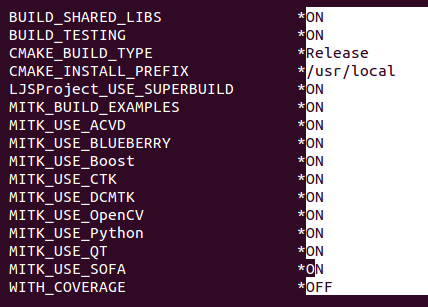
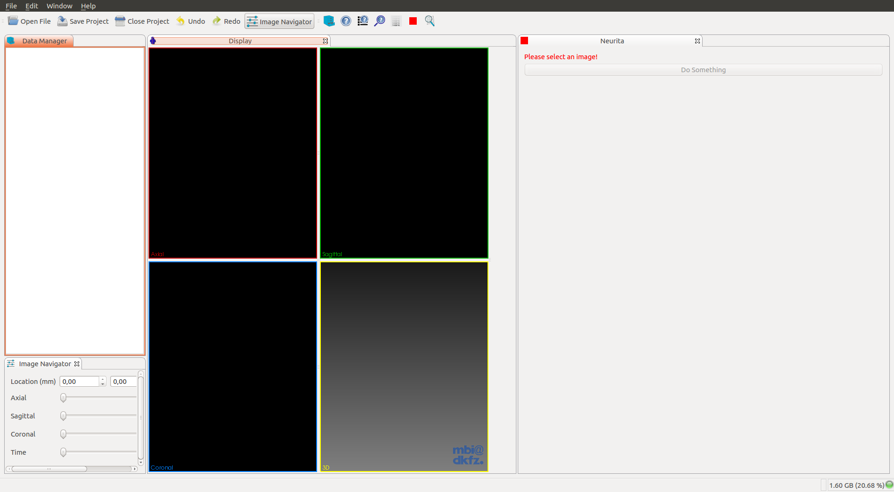
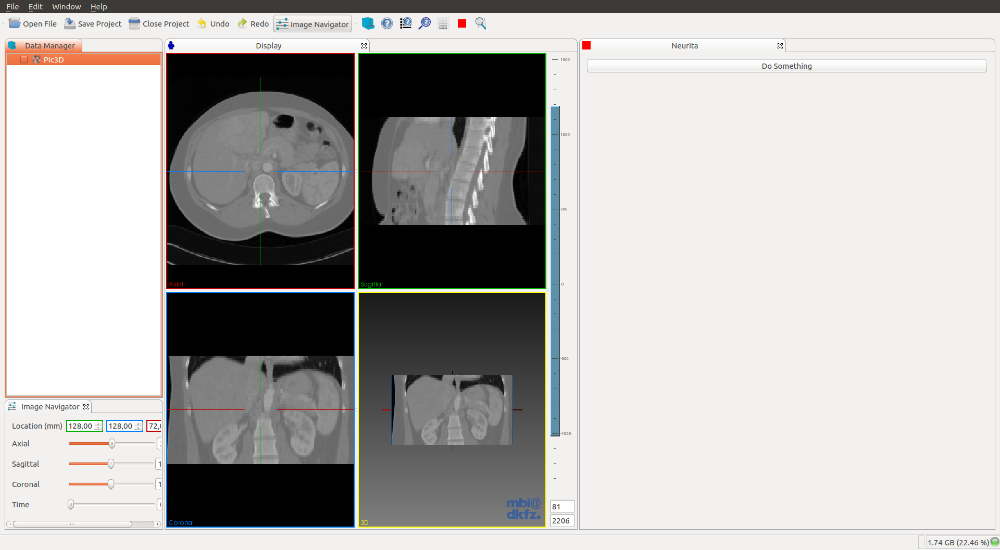
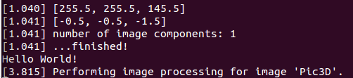

Title: How to create a Python plugin for MITK
Date: 2015-08-20
modified: 2015-09-02
Category: MITK, python
Tags: MITK, python
Author: Luis Javier Salvatierra
Email: ljsalvat@gmail.com
Summary: A manual on how to create a simple Python plugin for MITK.

[TOC]

## Plugins examples

- <a target="_blank" href="https://github.com/ljsalvatierra/mitk-plugins">MITK plugins</a>.
- <a target="_blank" href="https://github.com/ljsalvatierra/mitk-projects">MITK projects</a>.


## Creating a MITK plugin with MitkPluginGenerator

* For more information, go to <a target="_blank" href="http://docs.mitk.org/2015.05/NewPluginPage.html">`MitkPluginGenerator`</a>.

* There are two ways of accomplish the same result.:

- [Creating a MITK plugin](#creating-a-mitk-plugin).:
```bash
$ ./MitkPluginGenerator --plugin-symbolic-name org.mycompany.myplugin --view-name "My View"
```

- [Creating a MITK project](#creating-a-mitk-project) (recommended).:
```bash
$ ./MitkPluginGenerator --plugin-symbolic-name org.mycompany.myplugin --view-name "My View" \
  --project-name "MyProject" --project-app-name "MyApp"
```

It is recommended to take the second approach because you only have to build MITK once.
With the first approach you would have to rebuild MITK every time you make a change to
your plugin/s, instead, with the second approach, each time you make a change to your plugin,
you only have to compile your project.

## Creating a MITK plugin

```bash
$ /path/to/MITK-build/bin/MitkPluginGenerator -h
$ /path/to/MITK-build/bin/MitkPluginGenerator --out-dir /output/directory \
  --vendor Plugin_vendor_name --view-name "My View" --plugin-symbolic-name org.mycompany.myplugin
$ cd /output/directory && ls
org.mycompany.myplugin
$ cd org.mycompany.myplugin && ls
CMakeLists.txt  documentation  files.cmake  manifest_headers.cmake  plugin.xml  resources  src
```

* Modify MITK to build with the new plugin.:

```bash
$ cp -r ../org.mycompany.myplugin /path/to/MITK/Plugins && cd /path/to/MITK/Plugins
$ vim PluginList.cmake
# Add your plugin with the flag 'ON'.
```
```cmake
set(MITK_PLUGINS

  org.mycompany.myplugin:ON  

  org.blueberry.core.runtime:ON

  ...
```

* Set a new CTK Plugin in `CMakeLists.txt`.:

```bash
$ cd /path/to/MITK
$ vim CMakeLists.txt
# Search the string 'set(re_ctkplugin'
/set(re_ctkplugin
```

* Modify it to look like this.:

```cmake
# Specify which plug-ins belong to this project
  macro(GetMyTargetLibraries all_target_libraries varname)
    set(re_ctkplugin_mitk "^org_mitk_[a-zA-Z0-9_]+$")
    set(re_ctkplugin_bb "^org_blueberry_[a-zA-Z0-9_]+$")
    set(re_ctkplugin_mycompany "^org_mycompany_[a-zA-Z0-9_]+$")
    set(_tmp_list)
    list(APPEND _tmp_list ${all_target_libraries})
    ctkMacroListFilter(_tmp_list re_ctkplugin_mitk re_ctkplugin_bb re_ctkplugin_mycompany OUTPUT_VARIABLE ${varname})
  endmacro()
```

    `set(re_ctkplugin_`**`mycompany "^org_mycompany_[a-zA-Z0-9_]+$"`**`)`
    `ctkMacroListFilter(_tmp_list re_ctkplugin_mitk re_ctkplugin_bb `**`re_ctkplugin_mycompany`**` OUTPUT_VARIABLE ${varname})`

### Modify your plugin

* Add Python module dependency to the plugin `CMakeLists.txt`.

```cmake
mitk_create_plugin(
  EXPORT_DIRECTIVE EXAMPLE_EXPORT
  EXPORTED_INCLUDE_SUFFIXES src
  MODULE_DEPENDS MitkQtWidgetsExt MitkPython
)

```

### Embed Python in the new plugin

#### Interact with <a target="_blank" href="http://docs.mitk.org/2015.05/classmitk_1_1PythonService.html">Mitk Python Service</a>.

When we create a plugin with `MitkPluginGenerator` the default view contains a button `Do something`. Each time we press that button, it calls the function `DoImageProcessing()` that prints a message in the console/terminal.

```cpp
// MyView.cpp

...

// Add the Python Service header
#include <mitkPythonService.h>

...

// If you followed the instructions then you have the default plugin
// with this function

void MyView::DoImageProcessing()
{
  QList<mitk::DataNode::Pointer> nodes = this->GetDataManagerSelection();
  if (nodes.empty()) return;

  mitk::DataNode* node = nodes.front();

  if (!node)
  {
    // Nothing selected. Inform the user and return
    QMessageBox::information( NULL, "Template", "Please load and select an image before starting image processing.");
    return;
  }

...
```

* Add this two line example to the end of the function `DoImageProcessing()`.:

```cpp
      ...
      message << ".";
      //MITK_INFO << message.str();

      // Each time we press that button will print `Hello World!` in the console/terminal
      // First we interact with mitkPythonService and execute a simple Python function.
      itk::SmartPointer<mitk::PythonService> _PythonService(new mitk::PythonService());
      std::string result = _PythonService->Execute( "print ('Hello World!')", mitk::IPythonService::SINGLE_LINE_COMMAND );

      message << "\n";
      message << result << "\n";
      MITK_INFO << message.str();

...
```

### Build MITK with your new plugin

```bash
$ cd /path/to/MITK-build #Clean directory
$ ccmake ../MITK
# Build with the option MITK_USE_PYTHON enabled.
# Configure and enable the option MITK_USE_SYSTEM_PYTHON
# Configure and toggle the advance view.
# Modify the Python path, library path and debug path, to use Python2.7 instead of Python3.4 or Python3.4m.
# Configure again and generate.
$ make

# The last command will take several hours.
```

## Creating a MITK project

```bash
$ mkdir MITK-projects && cd MITK-projects
$ /path/to/MitkPluginGenerator -h
$ /path/to/MitkPluginGenerator --plugin-symbolic-name org.mycompany.myplugin \
  --view-name "My View" --project-name "MyProject" --project-app-name "MyApp"
$ cd MyProject && ls
Apps  build  CMake  CMakeExternals  CMakeLists.txt  LICENSE.txt  Plugins  SuperBuild.cmake
```

### Modify your project/plugin

```bash
$ cd Plugins/org.mycompany.myplugin/src/internal && ls
org_mycompany_myplugin_Activator.cpp  org_mycompany_myplugin_Activator.h MyViewControls.ui MyView.cpp MyView.h
$ vim MyView.cpp
```
* [Embed Python in the new plugin](#embed-python-in-the-new-plugin). This part is shared between the two approaches.

* Add Python module dependency to the plugin `CMakeLists.txt`.

```bash
$ vim /path/to/MyProject/Plugins/org.mycompany.myplugin/CMakeLists.txt
```
```cmake
project(org_mycompany_myplugin)

mitk_create_plugin(
  EXPORT_DIRECTIVE EXAMPLE_PYTHON_EXPORT
  EXPORTED_INCLUDE_SUFFIXES src
  MODULE_DEPENDS MitkQtWidgetsExt MitkPython
)
```

### Build your new project

```bash
$ cd /path/to/MyProject
$ mkdir build && cd build
$ ccmake ..
``` 



`Press 't' to toggle advanced mode and specify the EXTERNAL_MITK_DIR`


`Configure and look if there are any modules left`

* For example.:
    - MITK_BUILD_ALL_PLUGINS	ON
    - MITK_VTK_DIR		/path/to/MITK-build/ep/share/vtk-6.2
    - MITK_OpenCV_DIR		/path/to/MITK-build/ep/src/OpenCV-build
    - ...

## Test it!

* Open the `MitkWorkbench`:

```bash
$ /path/to/MITK-build/bin/MitkWorkbench
```

* Open your plugin view:



* Open a new image to be able to press the button `Do something`:



* You should see this when pressing the button `Do something`:


