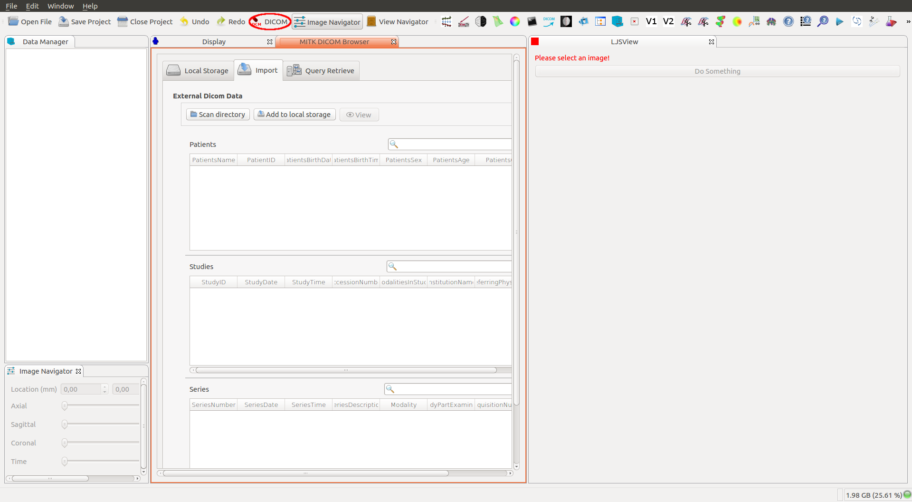
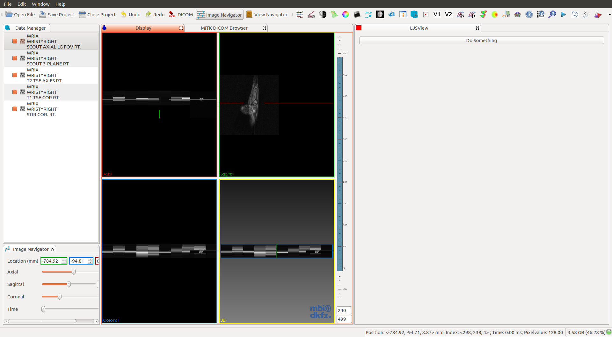
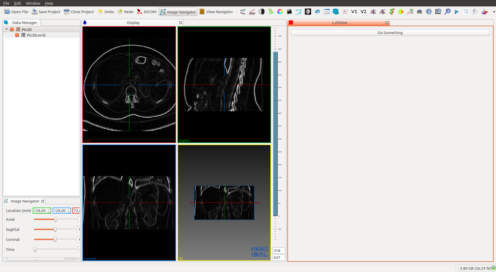

Title: How to interact with MITK images from Python
Date: 2015-10-09
modified: 2015-10-09
Category: MITK, python
Tags: MITK, python
Author: Luis Javier Salvatierra
Email: ljsalvat@gmail.com
Summary: A manual on how to interact with images loaded in MITK and processed in Python.

[TOC]

## Extending your MITK plugin

* I recommend that you build MITK with Boost enabled, also adding `filesystem` to the variable `MITK_USE_Boost_LIBRARIES`. It is not strictly necessary, but recommended for this example.

* Following the previous recommendation, you will need to modify your plugin `CMakeLists.txt`.
```cmake
project(com_company_example_python)

mitk_create_plugin(
  EXPORT_DIRECTIVE EXAMPLE_PYTHON_EXPORT
  EXPORTED_INCLUDE_SUFFIXES src
  MODULE_DEPENDS MitkQtWidgetsExt MitkPython
  PACKAGE_DEPENDS Boost #Add this line
)
```

* Boost in your plugin view file `MyView.cpp`.
```cpp
// Boost
#include <boost/filesystem.hpp>

namespace fs = boost::filesystem;
using fs::path;
```

* In order to follow this tutorial you will probably need the plugin source code. You can found it in my repository @ljsalvatierra.

    - <a target="_blank" href="https://github.com/ljsalvatierra/mitk-projects/blob/master/LJSProject/Plugins/com.ljsalvatierra.example_python/src/internal/LJSView.cpp">LJSView.cpp</a>
    - <a target="_blank" href="https://github.com/ljsalvatierra/mitk-projects/blob/master/python/mitk_python_images/mitk_python_images/raw_images.py">Python module</a> 

### Method 1: SimpleITK

* Process a SimpleItk image and load it in the MITK Viewer.
```cpp
//DoImageProcessing()
mitk::Image::Pointer postProcessedImage = this->ProcessSimpleItkImageInPython(image);
this->LoadImage(node, postProcessedImage, name);
```

Where `node` is a `mitk::DataNode` that contains the image. And `name` is one of the properties of the `node`.

I have successfully tested the plugin with Raw `.nrrd` and Dicom `.dcm` images. The Dicom images must be loaded with the `Open Dicom tool`, once that is loaded in the `DataStorage` you can get the image from the `node`.






How do we send the image to our Python module?

- Import the module.

```cpp
StringList code = QStringList()
    << "import sys"
    << "try:"
    << "    sys.path.append('" + pythonScriptsPath + "')"
    << "    import " + pythonPluginName + " as " + pythonPluginNameAlias
    << "    plugin_available = True"
    << "except ImportError:"
    << "    plugin_available = False"
    << "    raise ImportError('No module named " + pythonPluginName + "')"
```

- If we successfully import the module, call an example function.

```cpp
    << "if plugin_available:"
    << "    try:"
    << "        " + pythonOutputImage + " = "
                         + pythonPluginNameAlias + "." + pythonPluginFunction
                         + "(" + pythonInputImage + ")"
    << "    except TypeError:"
    << "        raise TypeError('Image Type Error')";
```

- Run the script.

```cpp
const std::string command = code.join("\n").toStdString();
m_PythonService->Execute(command, mitk::PythonService::MULTI_LINE_COMMAND);
```

Ok, but where is `pythonOutputImage`?

- Thanks to `PythonService` we can get all the variables saved in the stack.

```cpp
std::vector<mitk::PythonVariable> list = m_PythonService->GetVariableStack();
mitk::Image::Pointer outputImage;
if ( m_PythonService->DoesVariableExist(pythonOutputImage.toStdString()) )
{
    outputImage = m_PythonService->CopySimpleItkImageFromPython(pythonOutputImage.toStdString());
} 
```

Now that we have the image, how do we load it in the Workbench Viewer?
    
- Create a new node and populate it.

```cpp
mitk::DataNode::Pointer ds = mitk::DataNode::New();
ds->SetData(image);
ds->SetProperty("name", mitk::StringProperty::New(name + "_postProcessedImage"));
```

- Add the new node to the `DataStorage` with the original image as `Parent node`.

```cpp
this->GetDataStorage()->Add(ds,originalImageNode);
```

- Update the `RenderingManager`.

```cpp
mitk::RenderingManager::GetInstance()->RequestUpdateAll();
```

And that's it, you should see the processed image like this.


### Method 2: Other (process an image from path)

`This example doesn't work for dicom images.`

* Process an image from path.

```cpp
std::string imagePath = this->GetDataPath(data);
path p = path(imagePath);
std::string filename = p.filename().string();
std::string postProcessedImagePath = "/tmp/postProcessed_" + filename;
this->ProcessImageInPython(imagePath, postProcessedImagePath);
this->LoadImageFromPath(node, postProcessedImagePath, filename);
```

Where `GetDataPath()` is a function to get the image path inside `mitk::BaseData`.

```cpp
std::string imagePath = (data->GetProperty("path"))->GetValueAsString();
```

How do we send the image path to our Python module?

- Import the module, as in the first method (SimpleITK).

```cpp
QStringList code = QStringList()
    << "import sys"
    << "try:"
    << "    sys.path.append('" + pythonScriptsPath + "')"
    << "    import " + pythonPluginName + " as " + pythonPluginNameAlias
    << "    plugin_available = True"
    << "except ImportError:"
    << "    plugin_available = False"
    << "    raise ImportError('No module named " + pythonPluginName + "')"
```

- If we successfully import the module, call and example function.

```cpp
    << "if plugin_available:"
    << "    try:"
    << "        " + pythonPluginNameAlias + "." + pythonPluginFunction
                         + "('" + pythonInputImage + "','" + pythonOutputImage + "')"
    << "    except TypeError:"
    << "        raise TypeError('Image Type Error')";
```

- Run the script.

```cpp
const std::string command = code.join("\n").toStdString();
m_PythonService->Execute(command, mitk::PythonService::MULTI_LINE_COMMAND);
```

Now we need to get the output image path.

- Get the path from the variable stack.

```cpp
std::string outputImage;
std::vector<mitk::PythonVariable> list = m_PythonService->GetVariableStack();

for (auto &i : list){
    if ( i.m_Name == pythonOutputImage.toStdString() )
    {
        outputImage = i.m_Value;
        break;
    }
}
```

Load the image in the Workbench Viewer.

- Create a new node and load the image from path.

```cpp
mitk::StandaloneDataStorage::Pointer ds = mitk::StandaloneDataStorage::New();
mitk::StandaloneDataStorage::SetOfObjects::Pointer dataNodes = mitk::IOUtil::Load(processedImage, *ds);

mitk::DataNode::Pointer node = dataNodes->at(0);
```

- Add the new node to the `DataStorage` with the original image as `Parent node`.

```cpp
this->GetDataStorage()->Add(node,originalImageNode);
```

- Update the `RenderingManager`.

```cpp
mitk::RenderingManager::GetInstance()->RequestUpdateAll();
```

The result, as before, should look like this.



